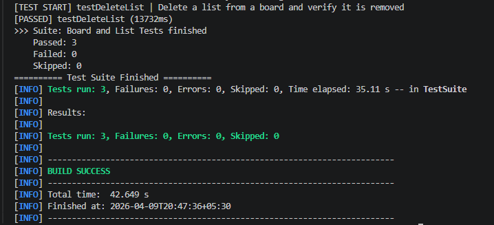
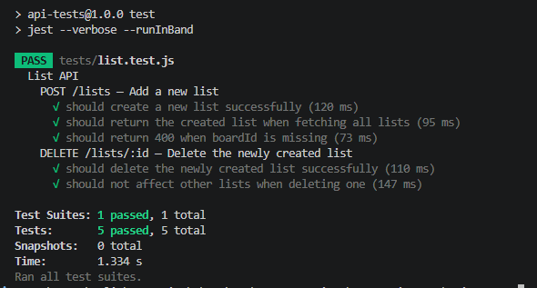

### UI Automation

- Selenium WebDriver (Java)
- TestNG
- Maven

### API Automation

- Jest

Install the app, simply clone this project and

1. `npm install`
2. `npm start`

## Tasks

**UI Automation Results**

```
1. Input a Board name, press enter. Verify Board created successfully.
2. Add two lists and verify two lists created successfully.
3. Delete a list.
```



**API Automation Results**

```
1. Add a new list
2. Delete the newly created list
```



👨‍💻 Author

Shashikala Weerasinghe

⭐ Quick Start

### Start app

npm install
npm start

### Run UI tests

mvn clean test

### Run API tests

npm test
